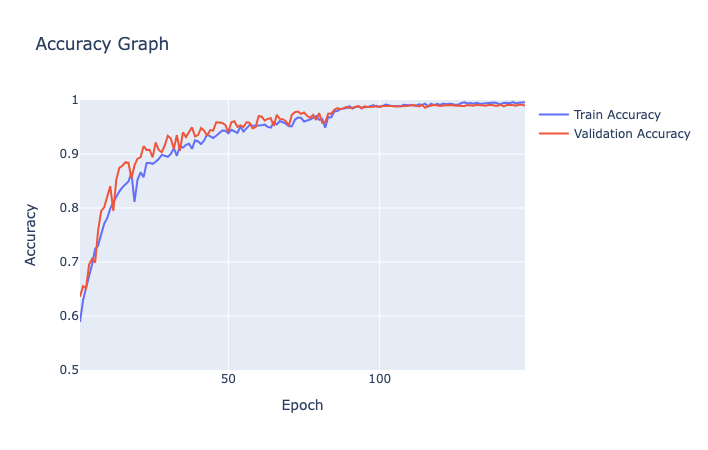
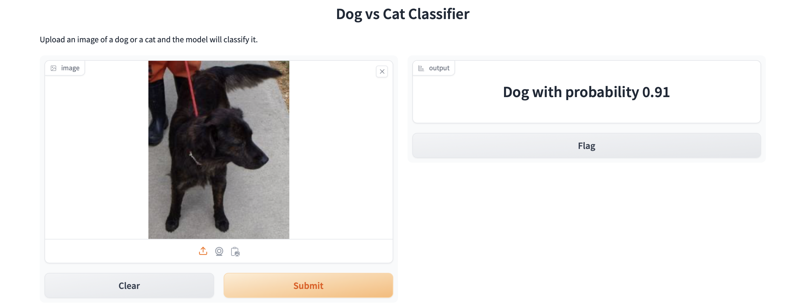

## Dogs vs Cats Classifier using EfficientNet

This repository contains a deep learning model for classifying images of dogs and cats using the EfficientNet-B0 architecture. The model is trained on the popular Dogs vs Cats dataset and uses transfer learning with the EfficientNet architecture to achieve high accuracy.

**Table of Contents**

	1.	Project Overview
	2.	Dataset
    3.	Training
	4.	Evaluation
	5.	Installation

**Project Overview**

This project will implement my own version of the EfficientNet-B0 model to classify dog and cat images.
For more details on the model I implemented. Please visit: https://arxiv.org/pdf/1905.11946.

The goal of this project is to improve my skills with:
	• Creating Pytorch vision models.
	• ML training pipelines.
	• Implementations of pre-commits (some custom made).
	• Employing github actions.
	• Learn about training on virutal GPUs.
	• Create an interface for the model's predictions.


**Dataset**

The dataset used in this project is the Dogs vs Cats dataset, which contains 8000 labeled images of dogs and cats for training.
You can download the dataset from Kaggle. The instructions will be provided below.

**Training**

Key Features:
	•	EfficientNet-B0 as the base model.
	•   Generic augmentation methods were applied.
	•   Trained on 2x RTX 3060.
	•	Trained with a batch size 32, starting learning rate of 1e-3 which is reduced on a plateau.

**Results**

The best training loss was at epoch: 143 with a training loss of 0.0198 training accuracy of 0.9942, validaiton loss of 0.0289:, validation accuracy of 0.9913.
However the test set results had a loss of 0.1463 and accuracy of 0.9600 indicating the model overfitted to the training data. A simpler model should have been used.
I will display the loss and accuracy plots below. 




**Visualization**

To visualize the model I created a web-based interface using Gradio. There any image could be uploaded and the model would classify the image to dog and cat and provide a probability. 



**Next Steps**
	• Rather than using an EfficientNet model a different architecture could be used.


**Installation**

To set up this project locally, follow these steps:

1. Clone the Repository:
```
git clone https://github.com/benbradshaww/dogs_vs_cats.git
```

2. Set Up the Virtual Environment:
```
python3 -m venv venv
# For Mac:
source venv/bin/activate
# For Windows:
venv\Scripts\activate
```

3. Install Dependencies:
pip install -r requirements.txt

4. Download the Dataset:

- Download the dataset from [Kaggle](https://www.kaggle.com/c/dogs-vs-cats/data).
- Unzip it and place the files into a `data/` directory.

Alternatively, if you have a valid Kaggle API in your home folder, run the function `download_data` to get the necessary data.
